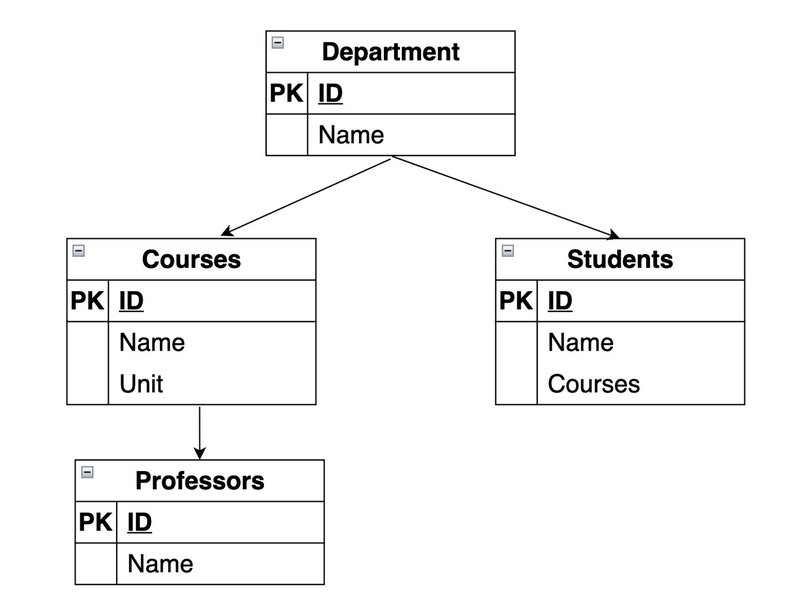
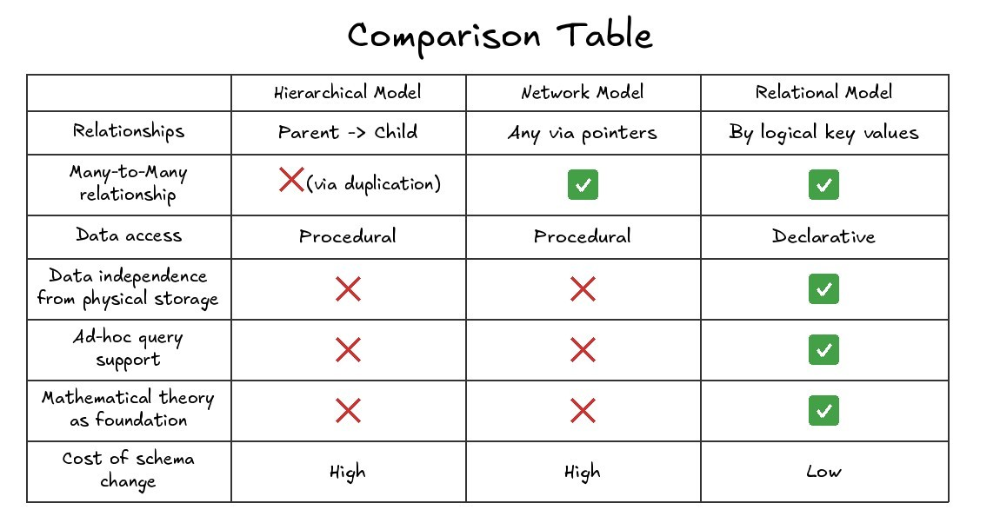

# How Data Modeling Evolved

In the mid-1960s, NASA had a problem. The Saturn V rocket had over three million parts. The rocket consisted of three modules. Each module was broken down into components, and those components into subcomponents. One component could belong to several modules at the same time.

Somebody had to store all of this. Somebody had to keep it up to date. IBM, working on the Apollo program, needed a system that could represent these deeply nested part-subpart relationships. The solution they built became IBM's Information Management System (IMS), released in 1966. That was the birth of the hierarchical data model.

This article traces the path from that original hierarchical model through the network model and into the relational model. What each approach got right, where it fell short, and why each successor appeared.

## The Hierarchical Data Model (1966)

The hierarchical model organizes data as a tree. One root table at the top, child tables branching downward. All relationships follow a strict parent-to-child pattern. A parent can have many children, but every child has exactly one parent.

*Figure 1: A hierarchical model. Department is the root. Courses and Students are its children. Professors belong to Courses. Navigation always flows top-down.*

Data access is procedural. The application tells the database engine exactly how to traverse the tree — start at the root, follow a pointer on disk, move to the next child. The physical layout of records on disk directly determines how the application navigates them. Pointers in memory connect parent records to their children. The application code is written around this physical structure.

**What worked well.** The model was simple. A tree is an intuitive structure. For domains like the Saturn V bill of materials — where parts genuinely nest inside assemblies — it was a natural fit. Performance was excellent too. Following a pointer on disk to reach a child record is a fast, direct operation.

**Where it broke down.** A child record cannot exist without its parent. Delete the parent — you lose the children. There is no native support for many-to-many relationships. If a student is enrolled in multiple courses, the only workaround is to duplicate that student's record under each course. That leads to data redundancy and inconsistency. The application is tightly coupled to the physical data structure. Any change to how records are arranged on disk means rewriting the application code. And there is no way to run ad-hoc queries. Every data retrieval path has to be predefined in the application.

## The Network Data Model (1969)

By the late 1960s, the CODASYL committee recognized the limitations of the hierarchical approach and proposed the network data model.

The network model represents data as vertices connected by edges. The key difference from the hierarchical model: navigation can start at any vertex, not just the root. A record can participate in multiple relationships at the same time. Many-to-many relationships are supported directly. No duplication required.

*Figure 2: A network model of the same domain. Professor1 connects to both Course1 and Course2. Students can be reached through multiple paths. No single root restriction.*

**What improved.** Many-to-many relationships became first-class citizens. A professor could teach multiple courses, a course could have multiple professors — without duplicating records. Queries became more flexible because traversal could start from any record type.

**What remained problematic.** Data access was still procedural. The application still had to specify the exact navigation path through the graph. To write correct queries, developers needed to know the schema's link structure inside and out. The application was still coupled to the physical storage layout. Any change to the data structure broke existing code. Ad-hoc queries were still not possible. Every access path had to be coded in advance.

## The Relational Data Model (1970)

In 1970, Edgar F. Codd, a researcher at IBM, published a "A Relational Model of Data for Large Shared Data Banks" paper that changed everything. His core idea: separate the logical representation of data from its physical storage. The user declares what they want to get. The system figures out how to get it.

This was a radical departure. In the hierarchical and network models, the programmer had to know the physical layout — which pointers to follow, which disk blocks to read, which navigation paths existed. Codd wanted to eliminate that coupling entirely.

In the relational model, data lives in tables. No physical pointers. Tables are linked through logical values — foreign keys that reference primary keys in other tables. The connection between a student and a course is not a memory address. It is a shared value in a column.

*Figure 3: The relational model. Department, Courses, Students, and Professors are independent tables. Many-to-many relationships are handled through junction tables (Student_Courses, Professor_Courses) using foreign keys.*

**What the relational model achieved.** Data became independent of its physical storage. Reorganizing files on disk no longer meant rewriting application code. The paradigm shifted from procedural to declarative access. Instead of telling the system how to navigate, you tell it what you need. An optimizer figures out the rest. Ad-hoc queries became possible for the first time. Analysts could ask questions that nobody anticipated during schema design. The model had a rigorous mathematical foundation — relational algebra and relational calculus. Normalization theory gave practitioners a way to eliminate data redundancy systematically. Many-to-many relationships were handled cleanly through junction tables and foreign keys.

**What it cost.** In the 1970s, the overhead of parsing declarative queries and computing execution plans made data access slower than following a pointer in a hierarchical or network database. The model required a query optimizer — a complex piece of software that translates a declarative request into an efficient physical access plan. Building reliable optimizers took years of research.

## Comparison Table

*Figure 4: Hierarchical, network, and relational models compared across seven criteria.*

The pattern is clear. The hierarchical and network models share more similarities than differences. Both rely on procedural access. Both tightly couple applications to physical storage. Neither supports ad-hoc queries. The relational model broke away from all of these constraints.

## Conclusion

Each model emerged as a direct response to the limitations of its predecessor. The hierarchical model solved the problem of representing nested structures — but could not handle many-to-many relationships without duplication. The network model fixed that — but still chained applications to the physical data layout and demanded procedural navigation. The relational model cut through both problems by putting a layer of logical abstraction between what the user asks for and how the system retrieves it.

Codd's insight — that the logical view of data should be completely independent of its physical storage — turned out to be one of the most consequential ideas in data modeling. It is the reason we can write a SQL query today without knowing which disk block holds the answer.
