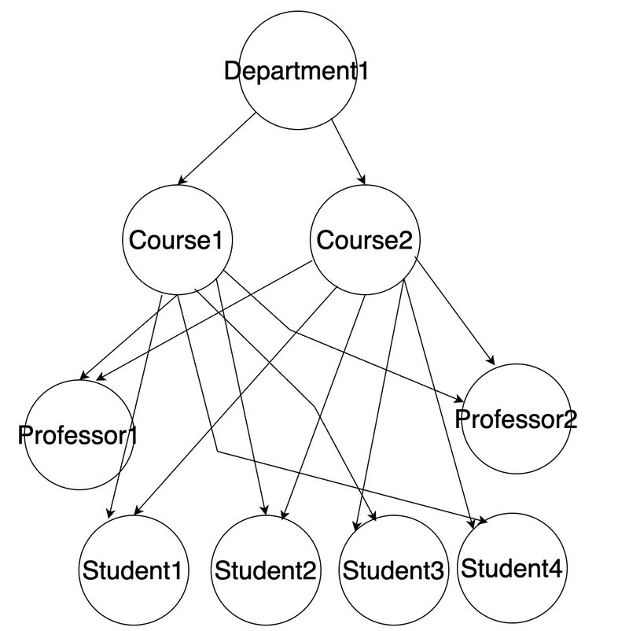
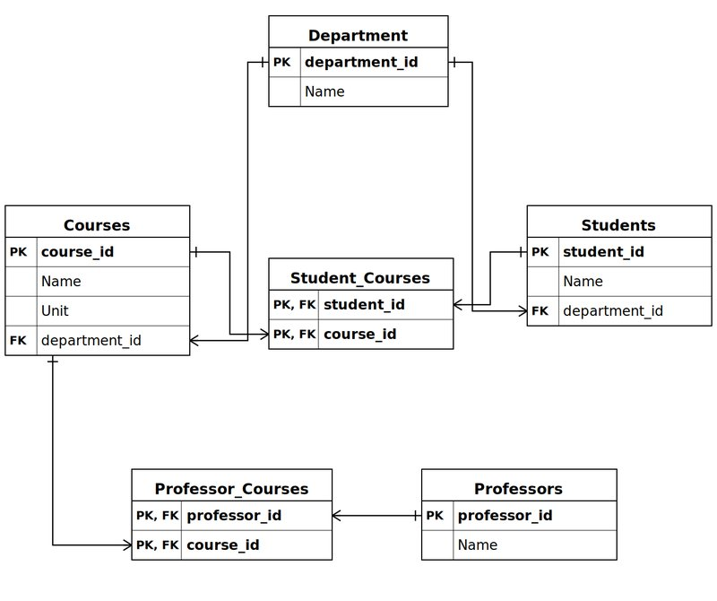
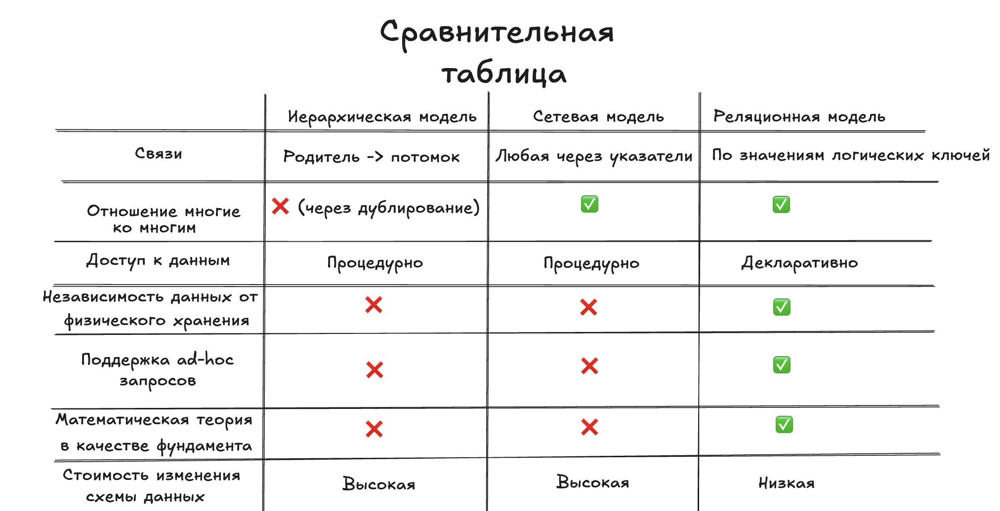

# Как развивалось моделирование данных

В середине 1960-х годов у NASA возникла проблема. Ракета Saturn V состояла из более чем трёх миллионов деталей, разбитых на три модуля. Каждый модуль делился на компоненты, а те — на подкомпоненты. При этом один компонент мог одновременно принадлежать нескольким модулям.

Возникла проблема хранения и поддержки данных в актуальном состоянии. IBM, работавшая над программой Apollo, нуждалась в системе, способной представлять такие глубоко вложенные иерархические отношения «компонент — подкомпонент». Созданное ими решение стало IBM Information Management System (IMS), выпущенной в 1966 году. Так родилась иерархическая модель данных.

В этой статье прослеживается путь от исходной иерархической модели через сетевую к реляционной. Что работало в каждом подходе, какие проблемы возникали и почему происходил следующий виток эволюции.

## Иерархическая модель данных (1966)

Иерархическая модель организует данные в виде дерева. Одна корневая таблица наверху, дочерние таблицы ветвятся вниз. Все отношения строго следуют схеме «родитель — потомок». У родителя может быть много потомков, но у каждого потомка ровно один родитель.

*Рис. 1: Иерархическая модель. Department — корень. Courses и Students — его дочерние узлы. Professors принадлежат Courses. Навигация всегда идёт сверху вниз.*

Доступ к данным — процедурный. Приложение указывает ядру базы данных, как именно обходить дерево: начать с корня, пройти по указателю на диске, перейти к следующему потомку. Физическое расположение записей на диске напрямую определяет, как приложение по ним перемещается. Указатели в памяти связывают родительские записи с дочерними. Код приложения пишется вокруг этой физической структуры.

**Что работало хорошо.** Модель была проста. Дерево — интуитивная структура. Для таких предметных областей, как спецификация компонентов Saturn V, она подходила идеально. Скорость к доступу данных тоже была отличной: пройти по указателю на диске к дочерней записи — быстрая и прямая операция.

**Какие был недостатки.** Дочерняя запись не может существовать без родителя. Удалите родителя — потеряете потомков. Нативной поддержки связей «многие ко многим» нет. Если студент зачислен на несколько курсов, единственный выход — дублировать запись студента под каждым курсом. Это ведёт к избыточности и несогласованности данных. Приложение жёстко привязано к физической структуре данных. Любое изменение расположения записей на диске требует переписывания кода приложения. И нет способа выполнять произвольные запросы: каждый путь доступа к данным должен быть заранее предусмотрен в приложении.

## Сетевая модель данных (1969)

К концу 1960-х годов комитет CODASYL осознал ограничения иерархического подхода и предложил сетевую модель данных.

Сетевая модель представляет данные как вершины, соединённые рёбрами. Ключевое отличие от иерархической модели: навигация может начинаться с любой вершины, а не только с корня. Запись может участвовать в нескольких отношениях одновременно. Связи «многие ко многим» поддерживаются напрямую. Дублирование не требуется.

*Рис. 2: Сетевая модель той же предметной области. Professor1 связан с Course1 и Course2. До Students можно добраться несколькими путями. Нет единственного корня.*

**Что улучшилось.** Связи «многие ко многим» стали полноценными. Преподаватель мог вести несколько курсов, курс мог иметь нескольких преподавателей — без дублирования записей. Запросы стали гибче, поскольку обход мог начинаться с любой вершины.

**Что по-прежнему было проблематично.** Доступ к данным оставался процедурным. Приложение по-прежнему должно было указывать точный путь навигации по графу. Чтобы писать корректные запросы, разработчики должны были знать структуру связей схемы вдоль и поперёк. Приложение всё ещё было привязано к физическому размещению данных. Любое изменение структуры данных ломало существующий код. Произвольные запросы по-прежнему были невозможны: каждый путь доступа к данным должен был быть заранее запрограммирован.

## Реляционная модель данных (1970)

В 1970 году Эдгар Ф. Кодд, исследователь IBM, опубликовал статью «A Relational Model of Data for Large Shared Data Banks», изменившую всё. Его ключевая идея: отделить логическое представление данных от их физического хранения. Пользователь объявляет, что хочет получить. Система сама решает, как это сделать.

Это было радикальное изменение. В иерархической и сетевой моделях программист должен был знать физическую структуру данных — по каким указателям следовать, какие блоки диска читать, какие пути навигации существуют. Кодд стремился полностью устранить эту привязанность.

В реляционной модели данные хранятся в таблицах. Никаких физических указателей. Таблицы связываются через логические значения — внешние ключи, ссылающиеся на первичные ключи других таблиц. Связь между студентом и курсом — не адрес в памяти, а общее значение в столбце.

*Рис. 3: Реляционная модель. Department, Courses, Students и Professors — независимые таблицы. Связи «многие ко многим» реализованы через таблицы соединений (Student_Courses, Professor_Courses) с использованием внешних ключей.*

**Чего достигла реляционная модель.** Данные стали независимы от физического хранилища. Реорганизация файлов на диске больше не требовала переписывания кода приложения. Парадигма сместилась от процедурного к декларативному доступу: вместо того чтобы указывать системе, как перемещаться, вы говорите ей, что нужно. Оптимизатор сам разбирается со всем остальным. Произвольные запросы стали возможны впервые. Аналитики могли задавать вопросы, о которых никто не думал при проектировании схемы. Модель имела строгое математическое основание — реляционную алгебру и реляционное исчисление. Теория нормализации дала практикам способ систематически устранять избыточность данных. Связи «многие ко многим» решались чисто через таблицы соединений и внешние ключи.

**Какой была цена.** В 1970-е годы накладные расходы на разбор декларативных запросов и вычисление планов выполнения делали доступ к данным медленнее, чем следование указателю в иерархической или сетевой базе данных. Модель требовала оптимизатора запросов — сложного программного компонента, переводящего декларативный запрос в эффективный план физического доступа. Создание надёжных оптимизаторов заняло годы исследований.

## Таблица сравнения

*Рис. 4: Иерархическая, сетевая и реляционная модели, сравниваемые по семи критериям.*

Закономерность очевидна. Иерархическая и сетевая модели имеют больше сходств, чем различий. Обе полагаются на процедурный доступ. Обе жёстко связывают приложения с физическим хранением данных. Ни одна не поддерживает произвольные запросы. Реляционная модель избавилась от всех этих ограничений.

## Заключение

Каждая модель появлялась как прямой ответ на ограничения своей предшественницы. Иерархическая модель решила задачу представления вложенных структур — но не могла обрабатывать связи «многие ко многим» без дублирования. Сетевая модель исправила это — но всё ещё привязывала приложения к физической компоновке данных и требовала процедурной навигации. Реляционная модель решила обе проблемы, поместив слой логической абстракции между тем, что запрашивает пользователь, и тем, как система это извлекает.

Идея Кодда — логическое представление данных должно быть полностью независимо от их физического хранения — оказалась одной из самых значимых в истории моделирования данных. Именно благодаря ней мы сегодня можем написать SQL-запрос, не зная как данные хранятся на диске.
