# Нормализация: первые три нормальные формы

В предыдущей статье мы разобрали реляционную модель Кодда: как она отделила логику данных от физического хранения и дала математический фундамент в виде реляционной алгебры. Но сам по себе фундамент ещё не гарантирует хорошую базу. На одной и той же реляционной модели можно спроектировать схему удобную, а можно — такую, которая ломается при каждом изменении данных. Сейчас спустимся на уровень практики и посмотрим, какие конкретные проблемы возникают в плохо спроектированной схеме и каким инструментом Кодд предложил их лечить — нормализацией.

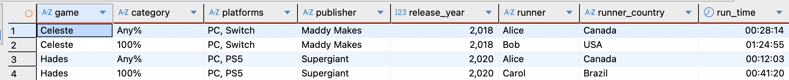

*Рис. 1: Исходная денормализованная таблица `speedrun_records`. Всё в одном месте: игра, категория, платформы, издатель, год релиза, раннер, его страна и время.*

Чтобы всё было наглядно, разберём на одном сквозном примере — базе рекордов по спидранам. Возьмём таблицу `speedrun_records` и пройдём весь путь от «свалили всё в кучу» до аккуратной нормализованной схемы. В таблице лежит: название игры, категория забега (`Any%` — пройти как можно быстрее, `100%` — собрать всё в игре), платформы, издатель игры, год релиза, имя раннера, страна, которую он представляет, и время прохождения.

## Что такое денормализованная таблица

Денормализованная таблица — это когда данные о разных сущностях свалены в одну широкую таблицу вместо нескольких связанных. Часто такую таблицу получают, соединив несколько таблиц через `JOIN`, но это не обязательно: схема может быть ненормализованной с самого начала, её никто не собирал из кусков.

Главный признак денормализации — **дублирование фактов**. Посмотрите на таблицу: издатель `Maddy Makes` записан дважды — по строке на каждую категорию Celeste. Страна раннера `Alice` тоже повторяется в каждом её забеге. Один и тот же факт лежит в базе в нескольких местах.

Сама по себе избыточность — ещё не катастрофа. Катастрофа в том, что она порождает три типа поломок при работе с данными. Их называют **аномалиями** (anomalies): обычное действие — добавить, изменить или удалить строку — приводит к тому, что база начинает противоречить сама себе или терять информацию. Разберём все три.

## Аномалия обновления

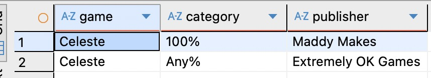

*Рис. 2: Издателя обновили только в одной строке Celeste. Теперь у одной игры два разных издателя — противоречие.*

Издатель решил сделать ребрендинг и сменить название. Факт «издатель Celeste» лежит в нескольких строках, поэтому обновить нужно их все разом. Достаточно обновить одну строку и пропустить другую — и в базе у одной и той же игры окажется два разных издателя. Данные стали несогласованными.

Важно понимать: это не «не повезло» и не редкий сбой. Это структурный изъян. Денормализованная схема **заставляет** хранить один факт в N местах и **никак не мешает** копиям разойтись. Рассинхрон здесь структурно предопределён.

## Аномалия вставки

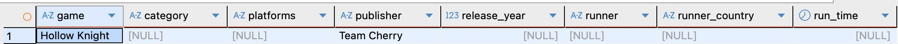

*Рис. 3: Hollow Knight известна, но добавить её в таблицу нельзя — поля `category`, `runner` и `run_time` нельзя оставить пустыми.*

Появилась новая игра — `Hollow Knight`. Издателя мы знаем, но рекордов по ней пока нет: ни категории, ни раннера, ни времени. Возникает затык: чтобы записать факт «такая игра существует и вот её издатель», нужно заполнить данные о забеге, которых ещё нет.

То есть факт об одной сущности (игре) нельзя записать, пока не появился несвязанный с ним факт о другой сущности (забеге). Информация о новой игре повисает в воздухе только из-за того, как устроена таблица.

Здесь же всплывает связанная проблема — отсутствие первичного ключа. В исходной таблице его нет намеренно: мы добавим его по ходу нормализации. Но именно из-за этого ничто не мешает завести дубль строки. А будь первичный ключ на месте, мы, наоборот, не смогли бы вставить «игру без забега» — запись просто не прошла бы по ограничению. Оба сценария — следствие плохой структуры, и оба чинятся нормализацией.

## Аномалия удаления

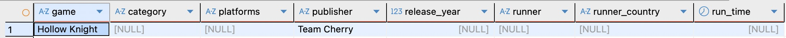

*Рис. 4: Удаляя запись категории 100% игры Hades, мы заодно теряем единственное упоминание раннера Carol и её страны.*

Самый коварный тип. Организаторы решили убрать категорию `100%` из рекордов `Hades` — удаляем одну строку. Но у раннера `Carol` это был единственный забег. Вместе с этой строкой из базы бесследно исчезает и факт «`Carol` представляет Бразилию» — он больше нигде не хранился.

Мы хотели удалить один факт (результат конкретной категории), а заодно случайно уничтожили совсем другой (информацию об участнике). Никто этого не заметит, пока кто-то не спросит про `Carol`.

Все три аномалии — симптомы одной болезни: **один факт хранится больше одного раза**. Лекарство тоже одно — разнести факты так, чтобы каждый хранился ровно один раз и ровно в одном месте.

Именно это и делают нормальные формы — каждая устраняет свой тип лишней зависимости. 1NF чинит неатомарность и отсутствие первичного ключа. 2NF убирает зависимости от части составного ключа. 3NF — зависимости между самими неключевыми атрибутами. Пройдём все три шага на нашей таблице.

## Первая нормальная форма

Начнём с колонки `platforms`. В ней платформы перечислены через запятую: `PC, Switch`. Это первое, что чинит 1NF.

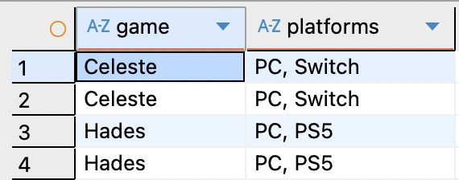

*Рис. 5: Несколько платформ перечислены в одной ячейке через запятую — нарушение атомарности.*

Какие проблемы это создаёт. Допустим, бизнесу нужно посчитать игры со спидранами на платформе Switch. Значение `Switch` спрятано внутри строки, поэтому обычное `WHERE platforms = 'Switch'` его не найдёт — равенство никогда не сматчит `PC, Switch`. Пришлось бы городить `LIKE '%Switch%'`, а это и ложные срабатывания, и мимо индекса: каждую строку нужно подпарсить вручную. Добавить платформу (скажем, перенесли Celeste на Xbox) — значит дописать значение через запятую руками. И никто не мешает положить в эту же строку что угодно ещё — число, массив. Работать с таким неудобно.

### Антипример: разнести в колонки

Кажется логичным «решить» это пивотом — разложить платформы по отдельным колонкам `platform_1`, `platform_2`, `platform_3`. Формально запятой в ячейке больше нет, выглядит аккуратнее.

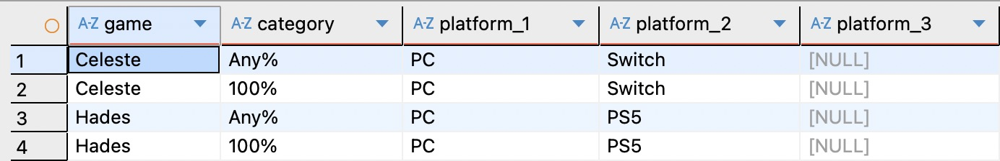

*Рис. 6: Платформы, разнесённые по пронумерованным колонкам. Запятая ушла, но это не 1NF, а её имитация.*

Но это не решение, а другая форма той же болезни — то, что Кодд называл **повторяющейся группой** (repeating group): один по смыслу атрибут размазан по нескольким пронумерованным колонкам. Проблемы только усугубляются. «Найти все игры на Switch» теперь требует перебрать все колонки `platform_1 OR platform_2 OR ...`, и появление `platform_4` сломает все такие запросы. Число платформ ограничено схемой. А добавить ещё одну платформу — это уже не вставка строки, а изменение структуры таблицы (`ALTER TABLE`). Поддерживать такое невозможно.

### Правильное решение

Атомарность означает: в каждой ячейке — ровно одно значение одного типа. Никаких списков, никаких пронумерованных колонок. Чтобы этого добиться, платформы выносят в отдельную таблицу `game_platforms`, по строке на каждую пару «игра — платформа», а колонку `platforms` из исходной таблицы убирают.

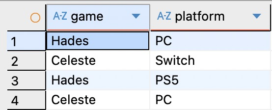

*Рис. 7: Платформы вынесены в отдельную таблицу. Каждая строка — один атомарный факт «игра доступна на платформе».*

Теперь искать игры на Switch можно обычным `WHERE platform = 'Switch'`, добавить платформу — это просто новая строка, а удалять и обновлять записи можно без всяких проблем. Первичный ключ `game_platforms` — пара `(game, platform)`: она гарантирует, что одна и та же платформа не добавится к игре дважды.

### Первичный ключ

1NF требует не только атомарности. Второе требование — у таблицы должен быть **первичный ключ** (primary key): колонка или набор колонок, однозначно идентифицирующий каждую строку.

У таблицы рекордов эту роль выполняет пара `(game, category)`: на каждую комбинацию «игра — категория» приходится один мировой рекорд, поэтому пара встречается в таблице ровно один раз.

> **Почему не `(game, category, runner)`?** В реальном лидерборде, где хранятся все забеги всех участников, ключом был бы тройной атрибут с раннером. Но тогда `runner` оказался бы в ключе, и транзитивной зависимости на шаге 3NF просто не возникло бы — нечего было бы разбирать. Мы намеренно упрощаем: оставляем `runner` неключевым и работаем с PK `(game, category)`, чтобы провести все три формы на одном примере.

Зачем нужен первичный ключ. PK не даёт завести дубли: повторно вставить запись с той же парой `(game, category)` уже не получится — база отклонит её с ошибкой.

Важно понимать ограничение: первичный ключ аномалию вставки **не лечит**. `category` входит в ключ и не может быть пустой — добавить «игру без забега» по-прежнему не выйдет. PK только делает эту проблему явной на уровне базы; саму её решает нормализация — разбиение сущностей по отдельным таблицам.


Итог. Первая нормальная форма требует двух вещей: значения должны быть **атомарными** (одно значение одного типа в ячейке), и у таблицы должен быть **первичный ключ**, чтобы исключить дубли строк.

## Вторая нормальная форма

После шага 1NF колонка `platforms` вынесена в отдельную таблицу `game_platforms`. В таблице рекордов теперь остались: `game`, `category`, `publisher`, `release_year`, `runner`, `runner_country`, `run_time`.

Прежде чем идти дальше, зафиксируем понятие, на котором держатся 2NF и 3NF: **функциональная зависимость** (functional dependency). Говорят, что атрибут Y функционально зависит от X (пишут X → Y), если каждому значению X соответствует ровно одно значение Y. Например, `game → publisher`: зная название игры, мы однозначно знаем её издателя — и нигде в таблице одна игра не может одновременно принадлежать двум разным издателям.

Таблица находится в 2NF, если она уже в 1NF и каждый неключевой атрибут **полностью функционально зависит** от всего составного ключа, а не от его части.

У таблицы рекордов **составной ключ** — пара `(game, category)`. Проверим, все ли атрибуты зависят от него целиком.

Возьмём `publisher` и `release_year`. Издатель и год релиза относятся к **игре** — то есть зависят только от `game`, а от `category` не зависят никак. Они висят на половине ключа. Это и есть нарушение 2NF, и именно отсюда растёт дублирование: «Maddy Makes выпустила Celeste в 2018» повторяется в каждой строке по Celeste. Остальные атрибуты — `runner`, `runner_country` и `run_time` — зависят от полного ключа `(game, category)` и нарушений 2NF не содержат.

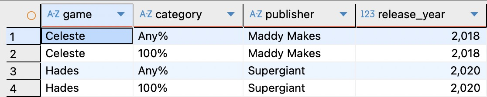

*Рис. 8: `publisher` и `release_year` зависят только от `game` — части составного ключа. Это частичная зависимость.*

Чиним декомпозицией: создаём таблицу `games`, где `game` — ключ, а `publisher` и `release_year` — её атрибуты. В таблице рекордов эти колонки удаляем и связываем таблицы по `game`.

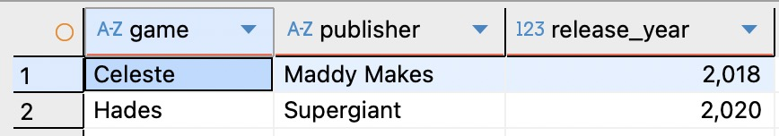

*Рис. 9: Издатель и год релиза вынесены в `games`. Теперь каждый факт об игре записан ровно один раз.*


Полезное наблюдение: 2NF выполняется автоматически, если ключ **не составной**. Будь ключом одна колонка `game`, частичной зависимости в принципе не бывает — не от чего отрезать «половину», и таблица уже была бы в 2NF. Частичные зависимости — это болезнь исключительно составных ключей.

Итог. Вторая нормальная форма требует, чтобы неключевые атрибуты зависели от составного ключа целиком, а не от его части.

## Третья нормальная форма

Таблица находится в 3NF, если она уже в 2NF и ни один неключевой атрибут не зависит от другого неключевого атрибута.

Осталась таблица рекордов с колонками `game`, `category`, `runner`, `runner_country`, `run_time`. Здесь подвох в `runner_country`. Страна зависит не от ключа `(game, category)`, а от `runner`. А `runner` сам не ключ.

Получается цепочка: ключ определяет раннера, раннер определяет страну. Это **транзитивная зависимость** (transitive dependency) — неключевой атрибут висит на другом неключевом атрибуте.

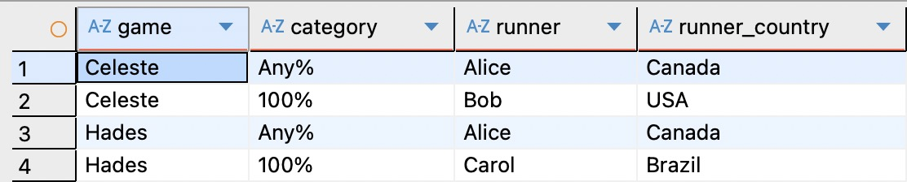

*Рис. 10: Транзитивная зависимость: ключ определяет раннера, а раннер — страну. `runner_country` висит на неключевом `runner`.*

Боль та же, что и раньше. `Alice` сменила гражданство — правь во всех её строках. Появился новый раннер без рекордов — страну записать некуда.

Чиним так же — выносим `runner` вместе с `runner_country` в новую таблицу `runners`, а в таблице рекордов оставляем `runner` как ссылку и связываем по нему. При переносе делаем `DISTINCT`, чтобы в `runners` не было дублей.

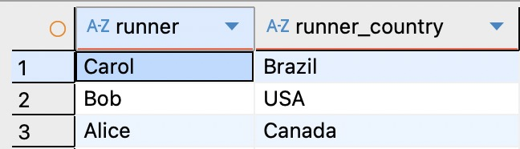

*Рис. 11: Страна раннера вынесена в `runners`. Каждый раннер записан в одном экземпляре.*

Итог. Третья нормальная форма требует, чтобы неключевые атрибуты зависели только от ключа, а не друг от друга. Если неключевой атрибут зависит от другого неключевого — это нарушение 3NF.

## Целевая схема

После трёх шагов из одной широкой денормализованной таблицы получилась нормализованная схема из нескольких связанных таблиц, где каждая строка отражает один-единственный факт без дублей.

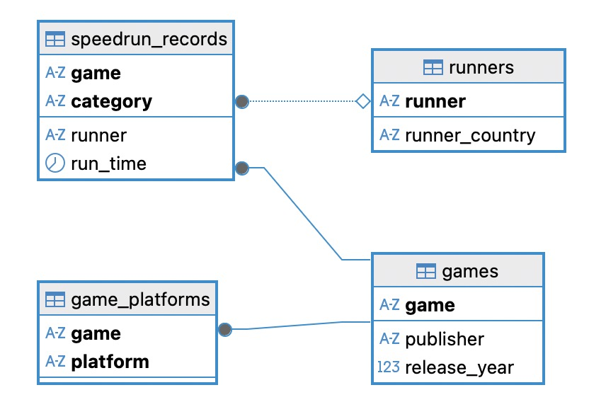

*Рис. 12: ER-диаграмма итоговой схемы. `speedrun_records` связана с `games` и `runners`, а `game_platforms` — с `games`.*

Получилось четыре таблицы. Центральная `speedrun_records` хранит только факт о рекорде: `game`, `category`, `runner`, `run_time`. Справочник `games` хранит данные об играх, `runners` — о раннерах, `game_platforms` — платформы. Одна важная деталь связей: `game_platforms` ссылается на `games`, а **не** на `speedrun_records`. Платформа относится к игре, а не к конкретному забегу, поэтому внешний ключ смотрит на таблицу-справочник игр.

В DBeaver эту схему удобно увидеть целиком через ER-диаграмму: была одна таблица с кучей столбцов — стала сеть связанных сущностей.

Все запросы из статьи — создание таблиц, демонстрация аномалий, пошаговая нормализация — собраны в файле [`normalization_1nf_2nf_3nf.sql`](./additional-content/normalization-1NF-3NF/normalization_1nf_2nf_3nf.sql). Поднять локальный PostgreSQL для экспериментов можно через [`docker-compose.yml`](./additional-content/normalization-1NF-3NF/docker-compose.yml) одной командой:

```bash
docker compose up -d
```

После этого подключайтесь к базе `speedrun` с пользователем `speedrun` на порту `5432` и запускайте скрипт.

## Заключение

Нормализация до третьей нормальной формы — это не что-то сверхъестественное. По сути это методичное устранение одной болезни: дублирования фактов, из которого растут аномалии вставки, обновления и удаления. Каждая форма убирает свой тип лишней зависимости — 1NF чинит неатомарность и отсутствие primary-key, 2NF убирает частичные зависимости от составного ключа, 3NF — транзитивные зависимости между неключевыми атрибутами.

Главную мысль удобно держать в голове одной фразой: **каждый факт должен храниться ровно один раз и ровно в одном месте**.

На практике для большинства задач трёх нормальных форм достаточно. Но это не конец истории. Существуют случаи, которые 3NF не покрывает — например, таблицы с несколькими перекрывающимися ключами или со скрытыми зависимостями между наборами значений. Для них придуманы более строгие формы: BCNF, 4NF, 5NF. С них мы и начнем в следующий раз.
